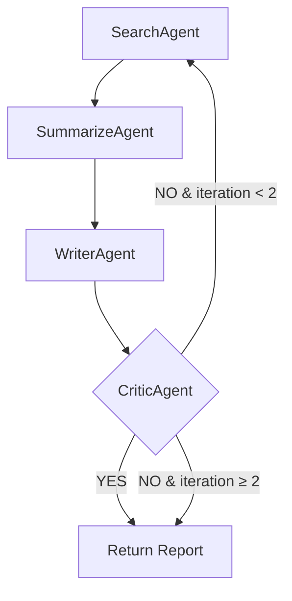

# AI / LLM / Agent Pipeline

## LLM Configuration

### Primary Model

| Attribute | Value |
|-----------|-------|
| Model | **GPT-4o** |
| Provider | OpenAI (via TensorZero) |
| Role | Primary model for all tasks |

### Fallback Model

| Attribute | Value |
|-----------|-------|
| Model | **openai/gpt-oss-120b** |
| Provider | Groq (via TensorZero) |
| Role | Automatic fallback when OpenAI is unavailable |

### Why GPT-4o

GPT-4o was selected as the primary model because:
- **Quality**: Report writing and factual analysis require a high-capability model
- **Speed**: GPT-4o has low latency compared to other frontier models
- **Cost-performance**: Better cost-per-token ratio than GPT-4 Turbo for equivalent quality
- **Availability**: OpenAI has the most reliable uptime among major LLM providers

### Why Groq as Fallback

Groq provides extremely fast inference for open-source models. As a fallback:
- **Speed**: Groq's custom LPU hardware delivers responses faster than most providers
- **Different infrastructure**: Provider diversity means an OpenAI outage doesn't take down the entire system
- **Cost**: Groq's free tier provides a safety net for low-volume fallback traffic

### Model Configuration

| Function | Temperature | Max Tokens | Use Case |
|----------|------------|------------|----------|
| `research_summarize` | 0.3 | 2000 | Search, summarize, critic, evaluation — factual accuracy over creativity |
| `report_write` | 0.5 | 4000 | Report writing — slightly higher creativity for professional prose |

**Why these temperatures:**
- 0.3 for factual tasks: low randomness reduces hallucination risk in search results and critic decisions
- 0.5 for writing: slightly higher randomness produces more natural, varied prose while maintaining accuracy

### LLM Routing (TensorZero)

```
Application code
    ↓ HTTP POST /inference
TensorZero Gateway (sidecar :3000)
    ↓ selects function → selects model → selects provider
    ├── openai_gpt4o (PRIMARY) → OpenAI API
    └── groq_fallback (FALLBACK) → Groq API
```

All LLM calls go through a single function: `_tz_call()` → `POST {tensorzero_url}/inference`. The application never calls OpenAI or Groq directly. This makes provider switching a configuration change, not a code change.

### Rate Limits & Cost

| Provider | Rate Limit | Cost (approximate) |
|----------|-----------|-------------------|
| OpenAI GPT-4o | Tier-dependent (typically 500–10,000 RPM) | ~$2.50/1M input, ~$10/1M output tokens |
| Groq | 8,000 requests/month (free tier) | Free (within quota) |

A single research job consumes 8–16 LLM calls. At an average of ~1,500 input tokens + ~1,000 output tokens per call, a job costs roughly $0.04–$0.12 with OpenAI GPT-4o.

---

## Embedding Model

| Attribute | Value |
|-----------|-------|
| Model | `all-MiniLM-L6-v2` |
| Framework | sentence-transformers 5.6.0 |
| Dimensions | 384 |
| Max Sequence Length | 256 tokens |
| Size | ~100 MB |
| Execution | **Local** — no API calls, no cost per embedding |

### Why all-MiniLM-L6-v2

- **Local execution**: No API calls needed, no per-embedding cost, no latency to external services
- **Small footprint**: ~100 MB model loads quickly and fits in memory
- **Good quality for short text**: Optimized for sentence-level similarity, which is ideal for comparing research topics
- **Pre-downloaded at build time**: The Dockerfile downloads the model during image build (`python -c "SentenceTransformer('all-MiniLM-L6-v2')"`) and sets `HF_HUB_OFFLINE=1` to prevent runtime downloads

### Where Embeddings Are Used

| Component | What is Embedded | Purpose |
|-----------|-----------------|---------|
| Semantic Cache | User's query/topic | Find cached results with similar topics |
| LTM Store | Topic text | Store report with searchable vector |
| LTM Search | Topic text | Find exact-match previous report |
| LTM Related Search | Topic text | Find related (not identical) previous reports |
| Report Diff | Topic text | Find semantically similar reports for comparison |

### Known Issue: Duplicate Instances

`cache.py` and `memory.py` each instantiate their own `SentenceTransformer("all-MiniLM-L6-v2")`, wasting ~100 MB of RAM. Both should share a single instance.

---

## Agent Pipeline — Deep Dive

### Pipeline Flow

```
User Topic
    ↓
SearchAgent: "Find 5 key facts about {topic}" [1 LLM call]
    ↓ search_results
SummarizeAgent: "Summarize these findings into bullet points" [1 LLM call]
    ↓ summaries
WriterAgent: "Write a comprehensive report on {topic}" [1 LLM call]
    ↓ report
CriticAgent: "Is this report factually consistent? YES/NO" [1 LLM call]
    ↓
    ├── YES → Output the report
    └── NO (& iterations < 2) → Loop back to SearchAgent
```

### State Management

All agents communicate via `ResearchState`, a TypedDict:

```python
class ResearchState(TypedDict):
    topic: str                    # Research topic
    session_id: str               # Conversation session
    session_history: list[dict]   # Last 4 conversation turns
    ltm_context: str              # Related previous report
    search_results: list[str]     # SearchAgent output
    summaries: list[str]          # SummarizeAgent output
    report: str                   # WriterAgent output
    verified: bool                # CriticAgent decision
    error: str                    # Error message if any
    iterations: int               # Pipeline loop count
```

There is no direct agent-to-agent communication. Each agent reads from and writes to the shared state object, and LangGraph handles the execution order via edges and conditional routing.

### Context Awareness

The pipeline is not a naive sequential chain. Two agents receive external context:

1. **SearchAgent** receives the user's last 4 conversation turns (from Redis session memory). This allows follow-up queries like "tell me more about the chips" to be understood in context.

2. **WriterAgent** receives a related (but not identical) previous report from long-term memory. This enables the system to build on existing research — if the user previously researched "AI chips" and now researches "GPU market", the writer has that prior report as reference and can highlight what has changed.

### Retry Loop



The OrchestratorAgent's `route()` method makes the decision:
```python
def route(self, state):
    if not state["verified"] and state.get("iterations", 0) < self.config.agent_max_iterations:
        return "search"  # retry
    return END  # accept (or give up)
```

**Trade-off**: Even if the critic keeps rejecting, the system returns the last report after `agent_max_iterations` retries rather than failing completely. This prioritizes availability over perfection.

---

## Hallucination Reduction

The system addresses hallucination at multiple levels:

### 1. System Prompts (TensorZero Templates)

**research_summarize** system prompt:
> "Be factual and specific. Do not hallucinate — if something is uncertain, say so explicitly."

**report_write** system prompt:
> "Cite specific facts, numbers, or dates when available. Do not pad with generic statements."

### 2. CriticAgent (Pipeline Stage)

The CriticAgent explicitly checks for "factual consistency and logical coherence." If it detects issues, it triggers a retry loop where the SearchAgent re-researches the topic.

### 3. LLM-as-Judge Evaluation

The `eval_hallucination` judge specifically checks for:
> "fabricated statistics, impossible dates, or claims that contradict well-known facts"

### 4. Low Temperature for Factual Tasks

The `research_summarize` function uses temperature=0.3, reducing the randomness that can introduce fabricated details.

### Limitations

- The system uses GPT-4o's own knowledge, not external search APIs. Facts are limited to the model's training data cutoff.
- The CriticAgent uses the same model that wrote the report, which means it shares the same knowledge gaps.
- There is no grounding against external sources — no web search, no document retrieval, no RAG from external knowledge bases.

---

## Evaluation System — Deep Dive

### How LLM-as-Judge Works

Each evaluator sends a structured prompt to the LLM asking for a `SCORE: X/10` rating:

```
eval_relevance: "Rate how relevant this report is to the topic..."
eval_completeness: "Does this report contain all four required sections..."
eval_hallucination: "Check this report for hallucinations..."
eval_quality: "Rate the overall quality of this report..."
```

The response is parsed with regex:
```python
m = re.search(r"SCORE:\s*(\d+(?:\.\d+)?)\s*/\s*10", text, re.IGNORECASE)
score = float(m.group(1)) / 10.0  # normalize to 0.0–1.0
```

If parsing fails, defaults to 0.5.

### Evaluation Flow

```
Report generated
    ↓
asyncio.create_task(evaluate_report()) — fire-and-forget
    ↓
asyncio.gather(4 judges in parallel)
    ↓
4 LLM calls via _judge() → TensorZero /inference
    ↓
Parse scores → Log to LangSmith dataset
```

### Batch Evaluation

Triggered via `POST /run-evaluation`. Unlike per-query evaluation, batch evaluation:
1. Fetches topics from the database (or uses provided topics)
2. **Re-runs the entire pipeline** for each topic (not just evaluation)
3. Generates full research reports + 4 evaluation judges per topic
4. Processes topics sequentially

This means a batch of 10 topics generates **80–160 LLM calls**.

### What Is NOT Implemented

- **Retrieval evaluation** — the system doesn't measure whether the search results are actually relevant to the topic
- **Automated threshold alerts** — no alerting when quality scores drop below a threshold
- **A/B evaluation** — no mechanism to compare different model configurations
- **Human evaluation** — no human-in-the-loop feedback mechanism
