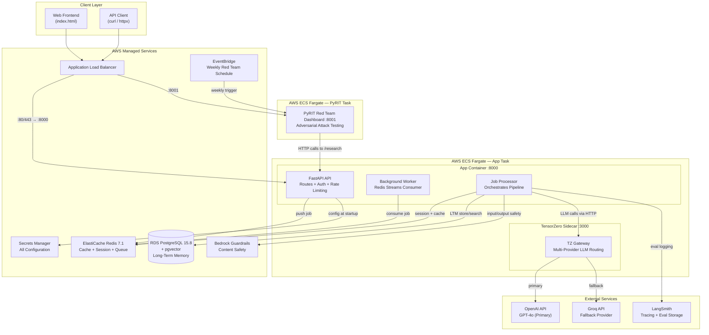
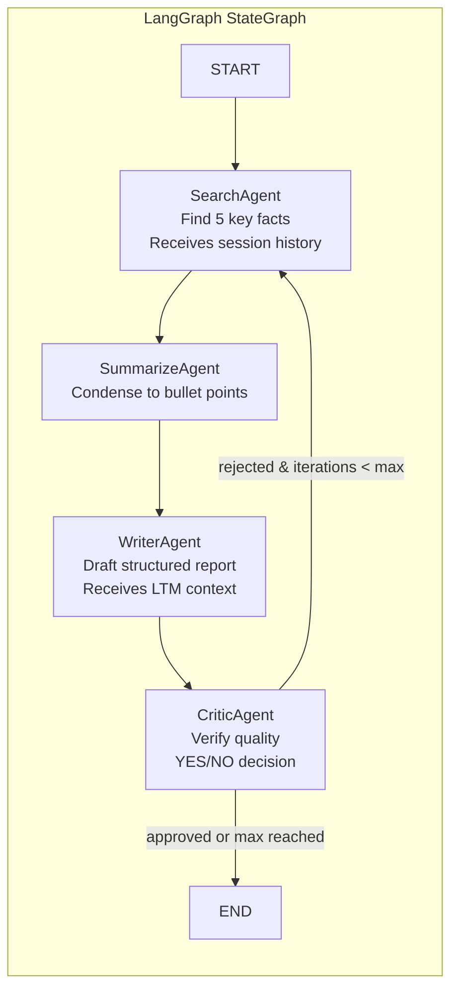
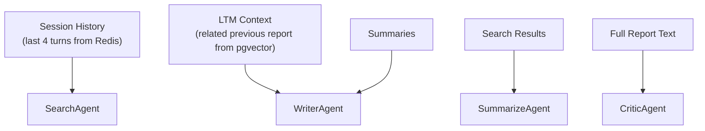
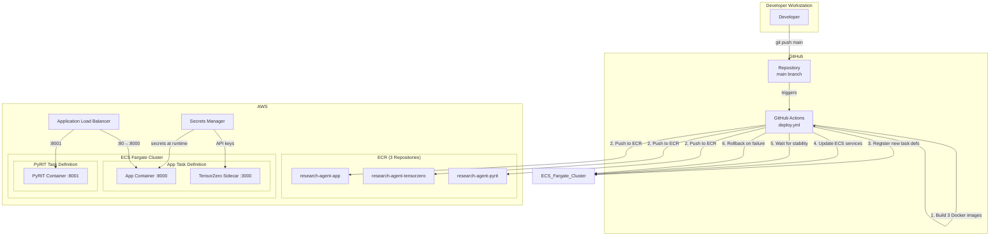
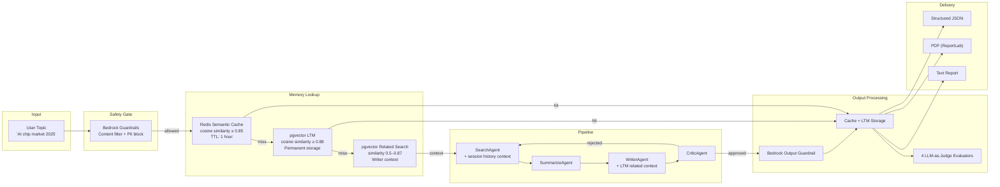
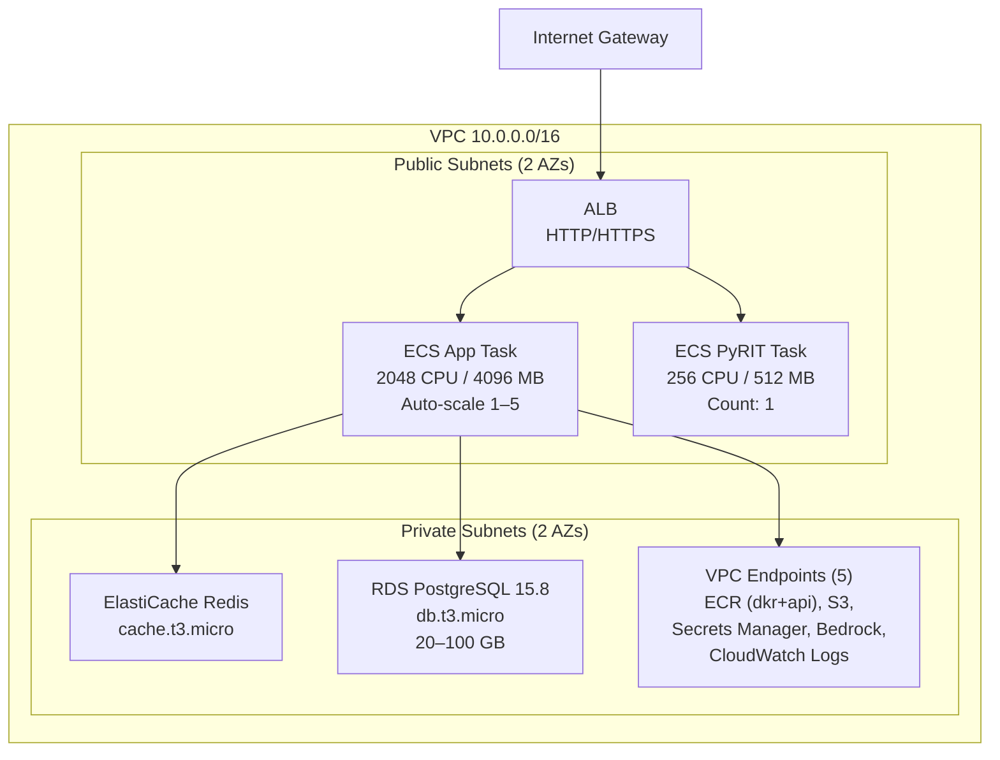

# Architecture

## High-Level Architecture

The Research Agent is a **multi-agent autonomous research pipeline** deployed on AWS ECS Fargate. A user submits a topic, and a LangGraph-orchestrated pipeline of four specialized agents (Search → Summarize → Write → Critic) produces a structured research report. All LLM calls are routed through a **TensorZero gateway sidecar** which dispatches to **OpenAI GPT-4o** (primary) with **Groq** as a fallback provider.



### Why This Architecture

| Decision | Rationale |
|----------|-----------|
| **Monolithic app with sidecar** | The research pipeline is inherently sequential (Search→Summarize→Write→Critic). A single service avoids network overhead between agents while the TensorZero sidecar cleanly separates LLM routing concerns. |
| **Async job queue (Redis Streams)** | Research jobs take 30–90 seconds. An async queue lets the API respond immediately with a `job_id` while the worker processes in the background, preventing HTTP timeouts. |
| **TensorZero as LLM gateway** | Instead of hard-coding LLM provider logic, all LLM calls go through TensorZero. This gives multi-provider routing, fallback, and prompt template management without application code changes. |
| **Separate PyRIT service** | Red teaming is an independent concern that runs adversarial attacks against the production API. Isolating it in its own ECS service prevents it from affecting production resources. |
| **VPC Endpoints instead of NAT Gateway** | VPC Endpoints for ECR, Secrets Manager, Bedrock, CloudWatch, and S3 provide private connectivity to AWS services without the ~$32/month cost of a NAT Gateway. |

---

## Request Lifecycle

### Complete Flow: Cache Miss, Full Pipeline Execution

```mermaid
sequenceDiagram
    participant U as User / Frontend
    participant ALB as ALB
    participant API as FastAPI API
    participant Redis as Redis (ElastiCache)
    participant Worker as Worker Loop
    participant BG as Bedrock Guardrails
    participant Cache as Semantic Cache
    participant LTM as PostgreSQL + pgvector
    participant Graph as LangGraph Pipeline
    participant TZ as TensorZero Sidecar
    participant LLM as OpenAI GPT-4o
    participant LS as LangSmith

    U->>ALB: POST /research {topic, session_id, output_format}
    ALB->>API: Forward request
    API->>API: require_api_key() — validate X-API-Key header
    API->>Redis: _rate_limit() — INCR + EXPIRE per client IP
    API->>BG: validate_input(topic) — content safety check
    BG-->>API: ALLOWED or BLOCKED
    API->>Redis: session_add(session_id, "user", topic)
    API->>Redis: push_job() — XADD to research:jobs stream
    API-->>U: {job_id, session_id}

    Note over Worker: Background worker picks up job

    Worker->>Redis: consume_jobs() — XREADGROUP
    Worker->>Redis: session_get(session_id) — fetch conversation history
    Worker->>Cache: cache_get(topic) — semantic similarity search
    Cache-->>Worker: MISS

    Worker->>LTM: ltm_search(topic) — pgvector similarity ≥ 0.88
    LTM-->>Worker: MISS

    Worker->>LTM: ltm_search_related(topic) — similarity 0.5–0.87
    LTM-->>Worker: Related report (if exists)

    rect rgb(40, 40, 80)
        Note over Graph,TZ: LangGraph Multi-Agent Pipeline
        Worker->>Graph: ainvoke(ResearchState)
        Graph->>TZ: SearchAgent → _tz_call("research_summarize")
        TZ->>LLM: POST /inference → GPT-4o
        LLM-->>TZ: 5 key facts
        TZ-->>Graph: search results

        Graph->>TZ: SummarizeAgent → _tz_call("research_summarize")
        TZ->>LLM: POST /inference → GPT-4o
        LLM-->>TZ: structured bullet points
        TZ-->>Graph: summary

        Graph->>TZ: WriterAgent → _tz_call("report_write")
        TZ->>LLM: POST /inference → GPT-4o
        LLM-->>TZ: structured report
        TZ-->>Graph: report

        Graph->>TZ: CriticAgent → _tz_call("research_summarize")
        TZ->>LLM: POST /inference → GPT-4o
        LLM-->>TZ: YES/NO verification
        TZ-->>Graph: approved or rejected

        Note over Graph: If rejected & iterations < 2: loop back to Search
    end

    Worker->>BG: validate_output(report) — output safety check
    Worker->>Cache: cache_set(topic, report) — store with TTL
    Worker->>LTM: ltm_store(topic, report, embedding) — permanent storage
    Worker->>Redis: session_add(session_id, "assistant", report)
    Worker->>Redis: set_result(job_id, result)

    rect rgb(40, 60, 40)
        Note over Worker,LS: Fire-and-forget Evaluation (4 LLM judges)
        Worker->>TZ: eval_relevance → _judge()
        Worker->>TZ: eval_completeness → _judge()
        Worker->>TZ: eval_hallucination → _judge()
        Worker->>TZ: eval_quality → _judge()
        Worker->>LS: Log scores to LangSmith dataset
    end

    U->>ALB: GET /result/{job_id}
    ALB->>API: Forward
    API->>Redis: get_result(job_id)
    Redis-->>API: {status: "done", report: "..."}
    API-->>U: Full report (text / PDF / JSON)
```



### LLM Call Count Per Job

| Scenario | Agent Pipeline | Evaluation | **Total LLM Calls** |
|----------|---------------|------------|---------------------|
| Cache or LTM hit | 0 | 4 | **4** |
| Pipeline, critic approves (1 iteration) | 4 | 4 | **8** |
| Pipeline, critic rejects once (2 iterations) | 8 | 4 | **12** |
| Pipeline, critic rejects twice (max) | 12 | 4 | **16** |

---

## Agent Pipeline Architecture



All agents communicate exclusively via `ResearchState` (a TypedDict shared state object). There are no direct agent-to-agent calls. Every LLM call flows through the single `_tz_call()` function, which hits the TensorZero sidecar's `/inference` endpoint.

| Agent | TZ Function | Temperature | Max Tokens | Purpose |
|-------|------------|-------------|------------|---------|
| SearchAgent | `research_summarize` | 0.3 | 2000 | Finds 5 key facts about the topic |
| SummarizeAgent | `research_summarize` | 0.3 | 2000 | Condenses search results into bullet points |
| WriterAgent | `report_write` | 0.5 | 4000 | Produces structured report (Exec Summary → Key Findings → Analysis → Conclusion) |
| CriticAgent | `research_summarize` | 0.3 | 2000 | Verifies factual consistency; returns YES/NO |
| OrchestratorAgent | — | — | — | Coordinates agents via LangGraph; routes retries |

### Context Flow Into Agents



The SearchAgent receives the user's last 4 conversation turns so it understands what angle the user cares about. The WriterAgent receives a related (not identical) previous report from long-term memory, so it can build on existing research rather than starting from scratch.

---

## Deployment Architecture



### Deployment Pipeline Steps

```
Developer pushes to main
    ↓
GitHub Actions triggers (deploy.yml)
    ↓
Checkout code
    ↓
Configure AWS credentials (access key + secret key)
    ↓
Login to ECR
    ↓
Build & push: app image (SHA + latest tags)
Build & push: pyrit image (SHA + latest tags)
Build & push: tensorzero image (SHA + latest tags)
    ↓
Save previous task definition ARN (for rollback)
    ↓
Register new task definitions with updated image URIs
    ↓
Update ECS services (or create if not active)
    ↓
Wait for app service stability
    ↓
On failure: rollback to previous task definition
```

---

## Data Flow



### Data Storage Summary

| Data | Store | Persistence | Key Format | TTL |
|------|-------|-------------|------------|-----|
| Job queue | Redis Streams | Transient | `research:jobs` | Until ACK'd |
| Job results | Redis String | 1 hour | `result:{job_id}` | 3600s |
| Semantic cache results | Redis String | 1 hour | `semantic:{hash(query)}` | 3600s |
| Semantic cache embeddings | Redis String | 1 hour | `emb:{hash(query)}` | 3600s |
| Session history | Redis List | 30 minutes | `session:{session_id}` | 1800s |
| Rate limit counters | Redis String | 60 seconds | `ratelimit:{ip}` | 60s |
| Reports + embeddings | PostgreSQL + pgvector | Permanent | `reports` table | None |
| Eval scores | LangSmith | Permanent | `research-agent-reports` dataset | None |
| Red team results | Redis String | Until eviction | PyRIT-managed keys | None |

---

## Infrastructure Architecture



| Resource | Type | Configuration | Purpose |
|----------|------|---------------|---------|
| VPC | 10.0.0.0/16 | DNS enabled, 2 AZs | Network isolation |
| Public Subnets | 10.0.0.0/24, 10.0.1.0/24 | Internet-routable | ALB + ECS tasks |
| Private Subnets | 10.0.10.0/24, 10.0.11.0/24 | No internet access | Databases + VPC endpoints |
| ALB | Application LB | HTTP listener, health check on `/health` | Traffic routing |
| ECS App Service | Fargate | 2048 CPU / 4096 MB, auto-scale 1–5 instances | Main application |
| ECS PyRIT Service | Fargate | 256 CPU / 512 MB, 1 instance | Red team dashboard |
| ElastiCache | Redis 7.1, cache.t3.micro | Single node, private subnet | Cache + queue + sessions |
| RDS | PostgreSQL 15.8, db.t3.micro | 20–100 GB, pgvector extension | Long-term memory |
| VPC Endpoints | 5 endpoints | ECR, S3, Secrets Manager, Bedrock, CloudWatch | Private AWS access (no NAT) |
| Auto-Scaling | Target tracking | CPU 70%, scale-out 60s, scale-in 300s | Horizontal scaling |
| Bedrock Guardrail | 1 guardrail + version | Content/topic/PII filters, all HIGH | Input/output safety |
| EventBridge | Weekly schedule | Monday 2 AM UTC | Automated red team runs |
| Secrets Manager | 1 secret | `research-agent/config` | All config + API keys |
| ECR | 3 repositories | `research-agent-app`, `-pyrit`, `-tensorzero` | Container images |
| CloudWatch | 3 log groups | `/ecs/research-agent-{app,pyrit,tensorzero}` | Centralized logging |
| IAM | 4 roles | ECS execution, ECS task, EventBridge | Least-privilege access |
