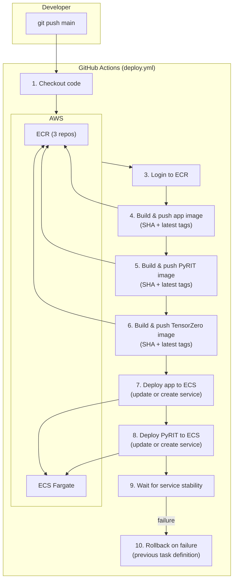

# CI/CD Pipeline

## Overview

The project uses **GitHub Actions** for continuous deployment. Every push to the `main` branch triggers a full build-and-deploy pipeline that builds 3 Docker images, pushes them to ECR, and deploys to ECS Fargate with automatic rollback on failure.



---

## Pipeline Configuration

**File:** [.github/workflows/deploy.yml](file:///d:/ai-resarch-agent/.github/workflows/deploy.yml)

| Setting | Value |
|---------|-------|
| Trigger | Push to `main` branch |
| Runner | `ubuntu-latest` |
| Region | `us-east-1` |
| Permissions | `contents: read`, `id-token: write` |

---

## Pipeline Steps (Detailed)

### Step 1–3: Setup

```yaml
- Checkout code (actions/checkout@v4)
- Configure AWS credentials (access key + secret key from GitHub Secrets)
- Login to Amazon ECR (amazon-ecr-login@v2)
```

### Step 4–6: Build & Push Docker Images

Three images are built and pushed to ECR, each tagged with both the Git SHA and `latest`:

| Image | Dockerfile | Build Context | ECR Repository |
|-------|-----------|--------------|----------------|
| App | `app/Dockerfile` | Project root | `research-agent-app` |
| PyRIT | `pyrit_dashboard/Dockerfile` | Project root | `research-agent-pyrit` |
| TensorZero | `tensorzero/Dockerfile` | Project root | `research-agent-tensorzero` |

### Step 7: Deploy App to ECS

This step uses **inline Python** to manipulate the ECS task definition JSON:

1. Save the currently running task definition ARN (for rollback)
2. Fetch the current task definition
3. Python script updates the `image` field for both `app` and `tensorzero` containers to the new SHA tag
4. Remove non-registerable fields (`taskDefinitionArn`, `revision`, `status`, etc.)
5. Register new task definition
6. Check if service is ACTIVE:
   - **ACTIVE**: Update service with new task definition
   - **MISSING**: Create service from scratch (handles first-time deployment)

### Step 8: Deploy PyRIT to ECS

Same pattern as app deployment, but only updates the single `pyrit` container.

### Step 9: Wait for Stability

```bash
aws ecs wait services-stable --cluster research-agent-cluster --services research-agent-app
```

Blocks until the new tasks are running healthy or times out.

### Step 10: Rollback on Failure

If any deployment step fails:

```bash
aws ecs update-service --task-definition {previous_task_def_arn}
aws ecs wait services-stable
```

Both app and PyRIT services are rolled back independently to their previous task definitions.

---

## Image Tagging Strategy

Each build produces two tags per image:

| Tag | Purpose | Example |
|-----|---------|---------|
| `{GITHUB_SHA}` | Immutable reference to exact commit | `a1b2c3d4e5f6...` |
| `latest` | Convenience tag for manual operations | `latest` |

The ECS task definition always references the SHA tag for reproducibility.

---

## Secrets Configuration

| Secret | Source | Purpose |
|--------|--------|---------|
| `AWS_ACCESS_KEY_ID` | GitHub Secrets | AWS API authentication |
| `AWS_SECRET_ACCESS_KEY` | GitHub Secrets | AWS API authentication |

> [!NOTE]
> The pipeline uses static AWS credentials stored as GitHub Secrets. A more secure alternative would be OIDC-based federation with `aws-actions/configure-aws-credentials`.

---

## What Is NOT in the Pipeline

| Missing Step | Impact |
|-------------|--------|
| **Unit tests** | No automated testing before deployment |
| **Linting** | No code quality checks |
| **Type checking** | No mypy/pyright validation |
| **Security scanning** | No container vulnerability scanning |
| **Staging environment** | No pre-production validation |
| **Branch protection** | Not configured (any push to main deploys) |
| **Blue/green deployment** | Rolling update via ECS, not zero-downtime blue/green |

---

## What Happens When You Push Code

```
1. Developer pushes to main
2. GitHub Actions triggers within ~30 seconds
3. Ubuntu runner starts (1-2 minutes)
4. AWS credentials configured
5. ECR login successful
6. App Docker image builds (~3-5 minutes, includes downloading sentence-transformers model)
7. PyRIT image builds (~2-3 minutes)
8. TensorZero image builds (~30 seconds)
9. All 3 images pushed to ECR
10. Previous task definition ARNs saved
11. New task definitions registered
12. ECS services updated with new images
13. ECS drains old tasks, starts new ones (~2-5 minutes)
14. ALB health checks pass on new tasks
15. Service stable — deployment complete
    OR
    Service unstable — automatic rollback to previous version
```

**Total pipeline time: ~10–15 minutes**

---

## Rollback Process

**Automatic (pipeline failure):**
The pipeline automatically rolls back both services to their previous task definitions if deployment fails.

**Manual rollback:**
```bash
# List recent task definition revisions
aws ecs list-task-definitions --family-prefix research-agent-app --sort DESC

# Update service to previous revision
aws ecs update-service \
  --cluster research-agent-cluster \
  --service research-agent-app \
  --task-definition research-agent-app:{previous_revision}
```
