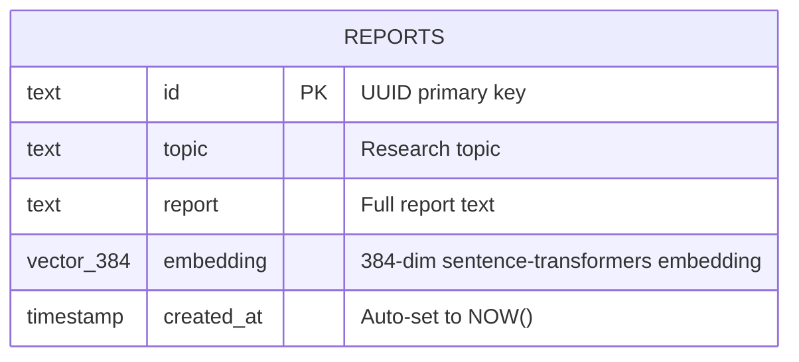
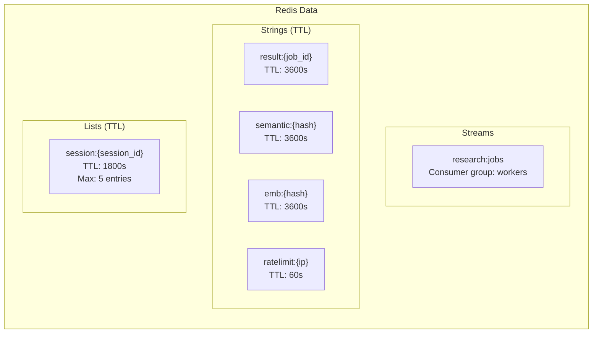

# Database & Data Model

## Database Technologies

| Database | Technology | Purpose | Persistence |
|----------|-----------|---------|-------------|
| Primary DB | PostgreSQL 15.8 + pgvector | Long-term report memory, vector search | Permanent |
| Cache/Queue/Session | Redis 7.1 (ElastiCache) | Semantic cache, job queue, session memory, rate limiting | Transient (TTL-based) |
| Eval Storage | LangSmith (external SaaS) | Evaluation scores, traces | Permanent (external) |

---

## PostgreSQL + pgvector

### Why PostgreSQL + pgvector

PostgreSQL with pgvector was chosen over standalone vector databases (Pinecone, Weaviate, Chroma) because:

1. **Single database** — Reports need both relational queries (topic lookup, date filtering) and vector similarity search. pgvector handles both in one database, eliminating the operational overhead of maintaining a separate vector DB.
2. **Managed service** — RDS PostgreSQL is a fully managed AWS service with automated backups (when enabled), patching, and monitoring.
3. **Cost** — At the current scale (hundreds to low thousands of reports), a `db.t3.micro` instance with pgvector is far cheaper than a dedicated vector database service.
4. **Familiar SQL** — Standard SQL with vector operators (`<=>` for cosine distance) means no new query language to learn.

### Schema



```sql
CREATE TABLE IF NOT EXISTS reports (
    id         TEXT PRIMARY KEY,
    topic      TEXT NOT NULL,
    report     TEXT NOT NULL,
    embedding  vector(384),
    created_at TIMESTAMP NOT NULL DEFAULT NOW()
);
```

### Indexes

| Index | Type | Column | Purpose |
|-------|------|--------|---------|
| `reports_embedding_idx` | IVFFlat (cosine) | `embedding` | Vector similarity search for LTM |
| `reports_topic_idx` | B-tree | `topic` | Topic lookup for diffs |
| `reports_created_idx` | B-tree | `created_at DESC` | Recency-based queries |

The IVFFlat index is configured with `lists = 100` (configurable). This is an approximate nearest neighbor index that trades a small amount of recall for significant speedup on large datasets.

### Query Patterns

| Operation | Query | Used By |
|-----------|-------|---------|
| **Exact LTM search** | `WHERE 1 - (embedding <=> $1::vector) > 0.88 ORDER BY similarity DESC LIMIT 1` | `ltm_search()` — skip pipeline if near-identical topic was recently researched |
| **Related search** | `WHERE 1 - (embedding <=> $1::vector) BETWEEN 0.5 AND 0.87 ORDER BY created_at DESC LIMIT 1` | `ltm_search_related()` — provide previous related report as writer context |
| **Topic diff** | `WHERE topic = $1 ORDER BY created_at DESC LIMIT 2` | `ltm_diff()` — compare latest 2 reports on same topic |
| **Semantic diff** | `WHERE 1 - (embedding <=> $1::vector) > 0.7 ORDER BY created_at DESC LIMIT 2` | `get_report_diff()` — compare reports via embedding similarity |
| **Recent topics** | `GROUP BY topic ORDER BY MAX(created_at) DESC LIMIT $1` | `fetch_recent_topics()` — for batch evaluation |

### Connection Pool

Managed by asyncpg with configurable min/max connections:
- Default min: 2
- Default max: 10
- Pool initialized at application startup, closed at shutdown

### Embedding Details

| Attribute | Value |
|-----------|-------|
| Model | `all-MiniLM-L6-v2` (sentence-transformers) |
| Dimensions | 384 |
| Source | Topic text (not report text) |
| Computation | CPU-bound, offloaded via `asyncio.to_thread` |
| Storage | `vector(384)` column in PostgreSQL |

### RDS Configuration

| Setting | Value | Note |
|---------|-------|------|
| Engine | PostgreSQL 15.8 | |
| Instance class | db.t3.micro | Smallest available, sufficient for current scale |
| Storage | 20–100 GB (autoscaling) | |
| Multi-AZ | No | Single AZ, acceptable for current needs |
| Backup retention | **0 days** | ⚠️ **No automated backups** — critical gap |
| Deletion protection | false | ⚠️ Could be accidentally deleted |
| Final snapshot | yes | `research-agent-postgres-final-snapshot` on delete |
| Subnet | Private subnets | Not internet-accessible |

> [!WARNING]
> `backup_retention_period = 0` means no automated backups. If the RDS instance fails, all long-term memory (reports + embeddings) is permanently lost. This should be set to at least 7 days in production.

---

## Redis (ElastiCache)

### Why Redis

Redis was chosen as a multi-purpose in-memory store because the application needs several transient data patterns that Redis handles natively:

1. **Semantic cache** — Key-value storage with TTL for cached research results
2. **Job queue** — Redis Streams with consumer groups provide reliable async processing with ACK semantics
3. **Session memory** — Redis Lists with auto-expiry for conversation context
4. **Rate limiting** — INCR + EXPIRE pattern for per-IP request throttling
5. **Red team results** — PyRIT stores attack results

Using one Redis instance for all these patterns avoids the complexity of multiple data stores.

### Data Structures



### Key Patterns

| Key Pattern | Type | TTL | Purpose |
|-------------|------|-----|---------|
| `research:jobs` | Stream | Until ACK'd | Job queue |
| `result:{job_id}` | String (JSON) | 3600s | Job results |
| `semantic:{hash(query)}` | String | 3600s | Cached report text |
| `emb:{hash(query)}` | String (JSON) | 3600s | Cached embedding vector |
| `session:{session_id}` | List (JSON) | 1800s | Conversation history |
| `ratelimit:{ip}` | String (counter) | 60s | Request count per IP |

### ElastiCache Configuration

| Setting | Value | Note |
|---------|-------|------|
| Engine | Redis 7.1 | |
| Node type | cache.t3.micro | Smallest available |
| Nodes | 1 | No replication, no failover |
| Subnet | Private subnet | Not internet-accessible |
| Encryption | Transit + at-rest | Standard for ElastiCache |

### Limitations
- **Single node** — no replication or automatic failover. If the Redis node fails, all cached data, active sessions, and pending jobs are lost.
- **Semantic cache O(n) scan** — `cache_get()` iterates through all `emb:*` keys, computing cosine similarity for each. This degrades linearly with cache size.

---

## LangSmith (External)

### Purpose
Stores evaluation scores and execution traces as an external SaaS service.

### Data Stored
- **Traces**: Every agent pipeline execution (SearchAgent, SummarizeAgent, WriterAgent, CriticAgent) is traced with input/output
- **Dataset**: `research-agent-reports` — contains evaluation scores for each completed job

| Field | Content |
|-------|---------|
| Inputs | `{topic}` |
| Outputs | `{report_preview: first 400 chars}` |
| Metadata | `{job_id, relevance, completeness, hallucination_risk, overall_quality}` |

### Integration
LangSmith is enabled by setting `LANGSMITH_API_KEY` in Secrets Manager. When present, the `Config` class sets `LANGCHAIN_TRACING_V2=true` in environment variables, which LangGraph's `@traceable` decorators pick up automatically.
