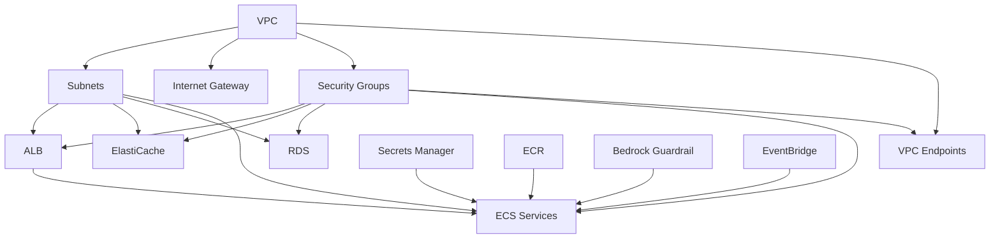

# Infrastructure

## Overview

All infrastructure is defined in a single Terraform file ([main.tf](file:///d:/ai-resarch-agent/terraform/main.tf), ~944 lines) and deployed to AWS `us-east-1`. The infrastructure uses **VPC Endpoints instead of NAT Gateway** to reduce costs — a deliberate design choice that saves ~$32/month.

## Terraform State

Terraform state is stored remotely in S3 with DynamoDB locking:

| Resource | Name | Purpose |
|----------|------|---------|
| S3 Bucket | `research-agent-tfstate` | State file storage |
| DynamoDB Table | `research-agent-tf-locks` | State locking (prevents concurrent modifications) |

Created by the one-time bootstrap script ([bootstrap.bat](file:///d:/ai-resarch-agent/bootstrap.bat) / `bootstrap.sh`).

---

## AWS Resources

### Networking

| Resource | Configuration | Purpose |
|----------|--------------|---------|
| VPC | 10.0.0.0/16, DNS enabled | Network isolation |
| Public Subnet 0 | 10.0.0.0/24, AZ a | ALB, ECS tasks |
| Public Subnet 1 | 10.0.1.0/24, AZ b | ALB, ECS tasks (HA) |
| Private Subnet 0 | 10.0.10.0/24, AZ a | Redis, RDS |
| Private Subnet 1 | 10.0.11.0/24, AZ b | RDS standby |
| Internet Gateway | Standard | Public internet access |
| Route Table | Public: 0.0.0.0/0 → IGW | Internet routing |

### VPC Endpoints (5 endpoints)

| Endpoint | Type | AWS Service | Why Needed |
|----------|------|-------------|------------|
| ECR DKR | Interface | Container image pulls | ECS pulls images without NAT |
| ECR API | Interface | ECR API calls | ECS image management |
| S3 | Gateway | S3 access for ECR layers | ECR stores image layers in S3 |
| Secrets Manager | Interface | Secret retrieval | App reads config at startup |
| Bedrock Runtime | Interface | Guardrails API | Content safety checks |
| CloudWatch Logs | Interface | Log shipping | Container log delivery |

**Why VPC Endpoints instead of NAT Gateway:**
A NAT Gateway costs ~$32/month (fixed) plus data transfer charges. VPC Endpoints cost ~$7.20/month (per interface endpoint × hours) with no per-GB charges. For this application, VPC Endpoints are significantly cheaper because outbound traffic to AWS services dominates (ECR pulls, Secrets Manager, Bedrock, CloudWatch).

### Load Balancer

| Setting | Value |
|---------|-------|
| Type | Application Load Balancer |
| Scheme | Internet-facing |
| Listeners | HTTP :80 → App target group (:8000), :8001 → PyRIT target group (:8001) |
| Health check | `GET /health` on port 8000 |
| Stickiness | None |

### Compute (ECS Fargate)

**App Service:**

| Setting | Value |
|---------|-------|
| Cluster | `research-agent-cluster` (Container Insights enabled) |
| CPU / Memory | 2048 / 4096 MB |
| Containers | `app` (:8000) + `tensorzero` sidecar (:3000) |
| Launch type | Fargate |
| Networking | Public subnets, auto-assigned public IP |
| Auto-scaling | Target tracking: CPU 70%, min 1, max 5 |
| Scale-out cooldown | 60 seconds |
| Scale-in cooldown | 300 seconds |

**PyRIT Service:**

| Setting | Value |
|---------|-------|
| CPU / Memory | 256 / 512 MB |
| Containers | `pyrit` (:8001) |
| Desired count | 1 (no auto-scaling) |
| Networking | Public subnets, auto-assigned public IP |

### Database (RDS PostgreSQL)

| Setting | Value | Note |
|---------|-------|------|
| Engine | PostgreSQL 15.8 | |
| Instance | db.t3.micro | |
| Storage | 20 GB (auto-scale to 100 GB) | |
| Multi-AZ | No | |
| Backup retention | **0 days** | ⚠️ No automated backups |
| Deletion protection | false | ⚠️ Risk of accidental deletion |
| Final snapshot | Yes | `research-agent-postgres-final-snapshot` |
| Extensions | pgvector | |
| Subnet group | Private subnets | |

### Cache (ElastiCache Redis)

| Setting | Value |
|---------|-------|
| Engine | Redis 7.1 |
| Node type | cache.t3.micro |
| Num nodes | 1 (no replication) |
| Subnet group | Private subnets |

### Container Registry (ECR)

| Repository | Scan on Push | Tag Mutability |
|-----------|-------------|----------------|
| `research-agent-app` | Yes | Mutable |
| `research-agent-pyrit` | Yes | Mutable |
| `research-agent-tensorzero` | Yes | Mutable |

### Bedrock Guardrail

Configured in Terraform with content filters (HIGH threshold), topic denials, PII blocking, and word filtering. See [Security](security.md) for details.

### EventBridge

| Schedule | Action | Target |
|----------|--------|--------|
| Monday 2:00 AM UTC | Run ECS task | PyRIT service (red team) |

### IAM Roles

| Role | Attached Policies | Used By |
|------|------------------|---------|
| ECS Execution Role | ECR pull, Secrets Manager read, CloudWatch Logs | ECS task startup |
| ECS Task Role | Bedrock Guardrails, CloudWatch Logs | Application runtime |
| EventBridge Role | ECS RunTask, IAM PassRole | Scheduled red team |

---

## Infrastructure Dependency Flow

---

## Cost Considerations

### Estimated Monthly Cost (Minimum Configuration)

| Resource | Estimated Cost | Notes |
|----------|---------------|-------|
| ECS Fargate (App) | ~$35–40 | 2048 CPU / 4096 MB, 1 instance |
| ECS Fargate (PyRIT) | ~$5–8 | 256 CPU / 512 MB, 1 instance |
| RDS db.t3.micro | ~$15 | On-demand |
| ElastiCache cache.t3.micro | ~$12 | On-demand |
| ALB | ~$16 | Fixed + LCU charges |
| VPC Endpoints (5 interface) | ~$36 | $0.01/hr × 5 × 720 hrs |
| ECR | ~$1 | Storage + transfer |
| Secrets Manager | ~$0.40 | 1 secret |
| CloudWatch Logs | ~$2–5 | Log storage |
| **Total Infrastructure** | **~$125–165/month** | |
| **OpenAI API** | Variable | ~$0.04–0.12 per job |
| **NAT Gateway (avoided)** | **$0 (saved ~$32)** | VPC Endpoints used instead |

### Cost Reduction Opportunities

1. **Spot/Fargate Spot**: ECS Fargate Spot pricing (~70% savings on compute) for non-critical tasks (PyRIT)
2. **Reserved Instances**: RDS and ElastiCache reserved instances for 1-year commitment
3. **Right-sizing**: Monitor actual CPU/memory usage and adjust ECS task definitions
4. **Reduce VPC Endpoints**: Consolidate if any endpoints are underutilized
5. **Cheaper LLM for eval**: Route evaluation to GPT-4o-mini via TensorZero configuration
