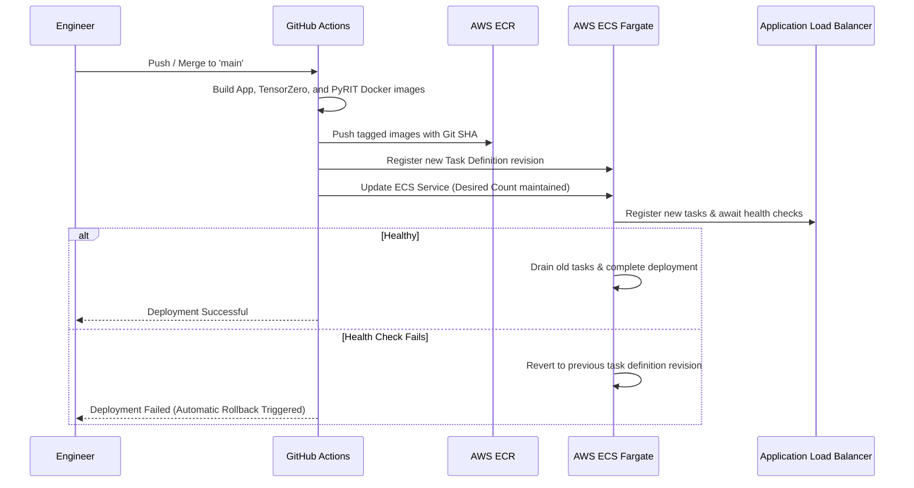

# Production Operations Guide

This guide details the day-to-day operations, incident response procedures, observability practices, and maintenance workflows for the **Autonomous Research Agent** deployed on AWS ECS Fargate.

---

## 1. System Overview & Key Endpoints

| Service / Role | Location / URL | Port | Health Check |
|----------------|----------------|------|--------------|
| **API & Background Worker** | ALB DNS | 80 / 443 | `GET /health` (:8000) |
| **TensorZero LLM Gateway** | ECS Localhost (Sidecar) | 3000 | `GET /health` (:3000) |
| **PyRIT Red Team Dashboard** | ALB DNS | 8001 | `GET /health` (:8001) |
| **PostgreSQL (pgvector)** | RDS Private Subnet | 5432 | Native TCP ping |
| **Redis (ElastiCache)** | Redis Private Subnet | 6379 | Redis `PING` |
| **Secrets Manager** | AWS Secrets Manager | — | `research-agent/config` |

---

## 2. Deployment & Rollback Procedures

### Standard CI/CD Deployment

All production deployments are automated via GitHub Actions in [.github/workflows/deploy.yml](file:///d:/ai-resarch-agent/.github/workflows/deploy.yml):



### Manual Emergency Rollback

If a bad deployment passes initial health checks but exhibits silent bugs or degradation in production:

1. **Identify Previous Stable Task Definition Revision:**
   ```bash
   aws ecs list-task-definitions --family-prefix research-agent-app --sort DESC --region us-east-1
   ```

2. **Rollback the App Service:**
   ```bash
   aws ecs update-service \
     --cluster research-agent-cluster \
     --service research-agent-app-service \
     --task-definition research-agent-app:<PREVIOUS_REVISION_NUMBER> \
     --force-new-deployment \
     --region us-east-1
   ```

3. **Verify Service Health:**
   ```bash
   aws ecs describe-services \
     --cluster research-agent-cluster \
     --services research-agent-app-service \
     --region us-east-1 \
     --query "services[0].deployments"
   ```

---

## 3. Observability, Logging & Monitoring

### CloudWatch Log Groups

Container stdout and stderr are streamed to AWS CloudWatch via the `awslogs` driver:

| Log Group | Container | Retention | Description |
|-----------|-----------|-----------|-------------|
| `/ecs/research-agent-app` | `app` | 30 days | FastAPI requests, worker loop, agent steps, errors |
| `/ecs/research-agent-app` | `tensorzero` | 30 days | LLM routing, fallback events, provider latencies |
| `/ecs/research-agent-pyrit` | `pyrit` | 30 days | Red team attack execution logs and scores |

### Essential CloudWatch Insights Queries

**1. Track Failed Research Jobs & Exceptions:**
```sql
fields @timestamp, @message
| filter @message like /ERROR/ or @message like /Exception/
| sort @timestamp desc
| limit 100
```

**2. Monitor TensorZero Fallback Triggers (OpenAI -> Groq):**
```sql
fields @timestamp, @message
| filter @message like /fallback/ or @message like /groq_fallback/
| sort @timestamp desc
| limit 50
```

**3. Inspect Bedrock Guardrail Blocks:**
```sql
fields @timestamp, @message
| filter @message like /BLOCKED/ or @message like /guardrail/
| sort @timestamp desc
| limit 50
```

### LangSmith Tracing & Evaluation Metrics

LangSmith provides fine-grained observability for every node in the LangGraph agent pipeline:
- **Project URL:** [https://smith.langchain.com/](https://smith.langchain.com/) → Project: `research-agent`
- **Key Metrics to Track:**
  - Token consumption per agent node (`SearchAgent`, `SummarizeAgent`, `WriterAgent`, `CriticAgent`)
  - Evaluator scores in dataset `research-agent-reports`:
    - `relevance` (Target: ≥ 0.85)
    - `completeness` (Target: ≥ 0.90)
    - `hallucination_risk` (Target: ≤ 0.15)
    - `overall_quality` (Target: ≥ 0.80)

---

## 4. Incident Response Runbooks

### Runbook A: Primary LLM Provider Outage (OpenAI)

- **Symptoms:** CloudWatch logs show repeated HTTP 500/503 or timeout errors from `api.openai.com`.
- **System Behavior:** TensorZero sidecar automatically catches the failure and diverts calls to **Groq (`llama-3.3-70b-versatile`)**.
- **Impact & Quota Warning:**
  - Groq free-tier limit is **8,000 requests/month**. Because each job consumes **8 to 16 LLM calls**, Groq quota will drain rapidly under high traffic.
- **Action Plan:**
  1. Verify OpenAI status page ([status.openai.com](https://status.openai.com)).
  2. If outage persists longer than 15 minutes, enable aggressive semantic caching or throttle traffic:
     ```bash
     # Increase semantic cache TTL and reduce rate limit in Secrets Manager
     aws secretsmanager update-secret \
       --secret-id "research-agent/config" \
       --secret-string '{"RATE_LIMIT_PER_MINUTE": "10", "SEMANTIC_CACHE_TTL": "86400"}' \
       --region us-east-1
     ```
  3. Force ECS task restart to load updated configuration:
     ```bash
     aws ecs update-service --cluster research-agent-cluster --service research-agent-app-service --force-new-deployment --region us-east-1
     ```

---

### Runbook B: Queue Backlog & Job Latency Spike

- **Symptoms:** API response status remains `"pending"` for >90 seconds; `/stats` shows `queue_depth > 20`.
- **Root Cause:** Influx of non-cached topics, CriticAgent loop retries, or rate limit throttling from LLM providers.
- **Action Plan:**
  1. Inspect queue depth and worker status:
     ```bash
     curl http://<ALB_DNS>/stats -H "X-API-Key: <SECRET_KEY>"
     ```
  2. Scale out ECS Fargate tasks manually if auto-scaling is delayed:
     ```bash
     aws ecs update-service \
       --cluster research-agent-cluster \
       --service research-agent-app-service \
       --desired-count 4 \
       --region us-east-1
     ```
  3. Verify that consumers have registered in the consumer group (`research-agent-group`) via Redis CLI:
     ```bash
     XINFO CONSUMERS research:jobs research-agent-group
     ```

---

### Runbook C: Bedrock Guardrail False Positives

- **Symptoms:** Legitimate technical or scientific research topics are rejected with `400 Bad Request: "Input blocked by content safety guardrails"`.
- **Action Plan:**
  1. Look up the blocked event in CloudWatch logs for the topic string.
  2. Inspect the Bedrock Guardrail configuration in the AWS Console (or [terraform/main.tf](file:///d:/ai-resarch-agent/terraform/main.tf)).
  3. Adjust the threshold from `HIGH` to `MEDIUM` for misclassified categories, or add an exclusion pattern.
  4. Apply via Terraform:
     ```bash
     cd terraform
     terraform apply -target=aws_bedrock_guardrail.research_guardrail
     ```

---

### Runbook D: Database Storage / Memory Pressure on RDS

- **Symptoms:** Database query latency increases; `pgvector` IVFFlat similarity searches slow down.
- **Action Plan:**
  1. Check RDS CloudWatch metrics: `FreeableMemory`, `CPUUtilization`, and `FreeStorageSpace`.
  2. If IVFFlat lists are unbalanced due to large report volume (>10,000 vectors):
     ```sql
     -- Reindex the vector index during off-peak hours
     REINDEX INDEX CONCURRENTLY reports_embedding_idx;
     -- Run vacuum analyze
     VACUUM ANALYZE reports;
     ```
  3. If storage exceeds 80%, increase the allocated storage or let AWS RDS storage autoscaling expand to 100 GB.

---

## 5. Maintenance & Secret Rotation

### Rotating API Keys & Secrets

All application secrets are centralized in AWS Secrets Manager:
`research-agent/config`

To rotate OpenAI, Groq, or LangSmith keys:

1. **Update Secret in AWS Secrets Manager:**
   ```bash
   aws secretsmanager put-secret-value \
     --secret-id "research-agent/config" \
     --secret-string file://new_secrets.json \
     --region us-east-1
   ```

2. **Trigger Rolling Restart of App Service:**
   Because [app/config.py](file:///d:/ai-resarch-agent/app/config.py) caches settings using `@lru_cache`, container instances must be recycled to read the new secrets:
   ```bash
   aws ecs update-service \
     --cluster research-agent-cluster \
     --service research-agent-app-service \
     --force-new-deployment \
     --region us-east-1
   ```

### Managing PyRIT Red Team Schedule

The automated red team attack runs every Monday at 2:00 AM UTC via AWS EventBridge.
- **To trigger an on-demand full run:**
  ```bash
  curl -X GET "http://<ALB_DNS>:8001/run-attacks?types=jailbreak,xpia,crescendo,skeleton_key"
  ```
- **To review attack results:**
  ```bash
  curl http://<ALB_DNS>:8001/results
  ```
- **Disable the weekly schedule:**
  ```bash
  aws events disable-rule --name "research-agent-pyrit-weekly" --region us-east-1
  ```

---

## 6. Disaster Recovery & Backup

| Component | RPO (Recovery Point Objective) | RTO (Recovery Time Objective) | Strategy |
|-----------|--------------------------------|-------------------------------|----------|
| **RDS PostgreSQL** | 24 hours (with automated backups enabled) | < 30 minutes | Snapshot restore to new RDS instance |
| **ElastiCache Redis** | Transient (0 data loss tolerance for queue) | < 10 minutes | Cluster recreate; queue jobs re-submitted |
| **ECS Compute** | 0 minutes | < 5 minutes | Fargate tasks redeployed from ECR images |
| **Terraform State** | Continuous | < 5 minutes | S3 Bucket Versioning + DynamoDB lock |

> [!IMPORTANT]
> The default Terraform template sets `backup_retention_period = 0` on RDS to minimize dev costs. For true production environments, update `backup_retention_period = 7` in [terraform/main.tf](file:///d:/ai-resarch-agent/terraform/main.tf) to enable point-in-time recovery (PITR).
